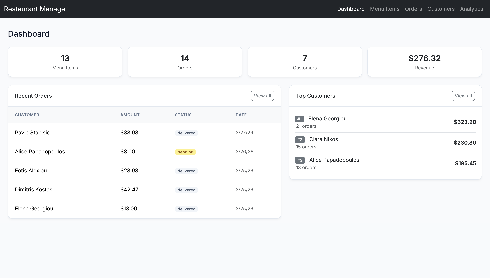
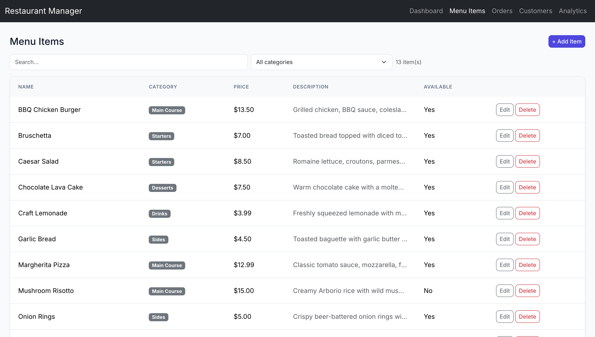
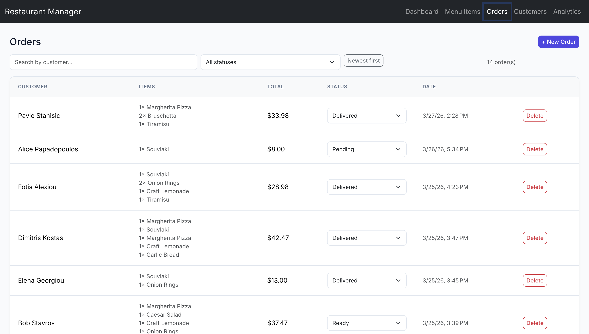
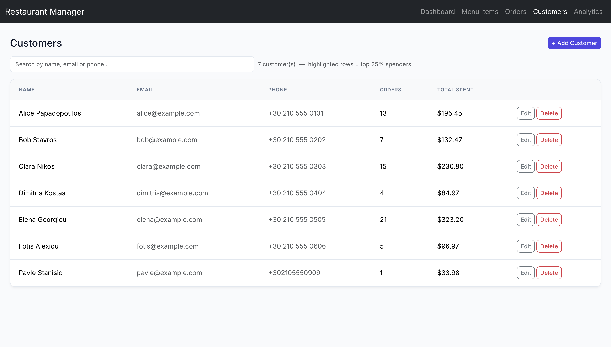
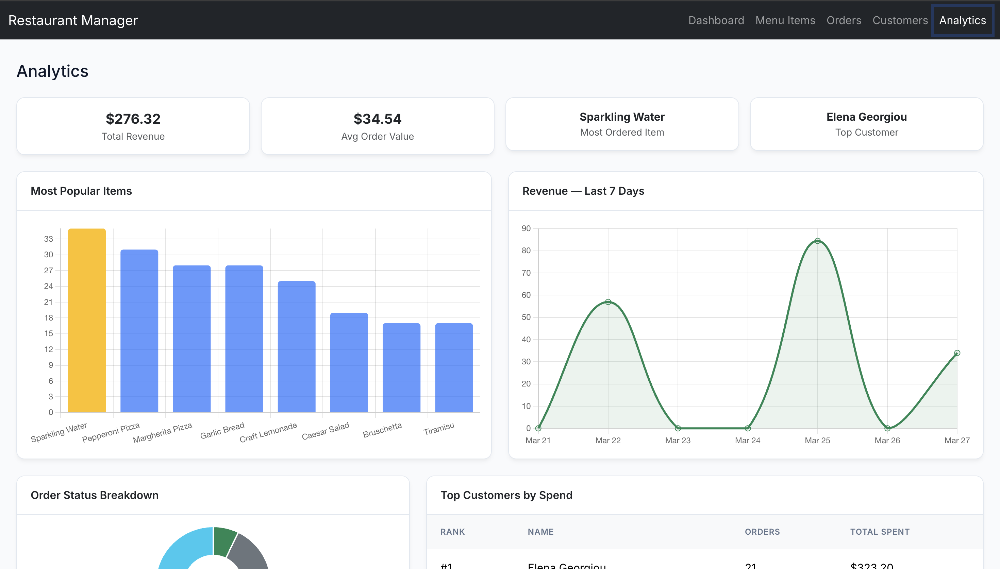

# Restaurant Manager

> CSC306 Advanced Web Development - Spring 2026

A full-stack, single-page web application for managing a restaurant's daily operations - menu catalogue, live order tracking, customer records, and a Chart.js analytics dashboard - built with **Angular 21**, **Firebase Realtime Database**, **Bootstrap 5**, and **Chart.js 4**.

---

## Table of Contents

1. [Live Demo](#live-demo)
2. [Screenshots](#screenshots)
3. [Features](#features)
4. [Tech Stack](#tech-stack)
5. [Architecture](#architecture)
6. [Data Models](#data-models)
7. [Getting Started](#getting-started)
8. [Firebase Setup](#firebase-setup)
9. [Project Structure](#project-structure)
10. [Advanced Feature](#advanced-feature)

---

## Live Demo

> Run locally following the [Getting Started](#getting-started) guide and open **http://localhost:4200**.

---

## Screenshots

### Dashboard

*Live stats: total menu items, orders, customers, revenue, recent orders, and top 3 customers by spend.*

### Menu Items

*Full CRUD with search, category filter, and sortable columns.*

### Orders

*Create orders from existing customers and menu items; update status in-line.*

### Customers

*Customer management with top-spender highlighting (gold badge for top 25%).*

### Analytics

*Chart.js visualisations: most popular items (bar), 7-day revenue (line), order status breakdown (doughnut), and top customers table.*

---

## Features

| Module | Capability |
|---|---|
| **Dashboard** | Real-time aggregated stats - item count, order count, total customers, revenue from delivered orders, last 5 orders, top 3 spenders |
| **Menu Items** | Create / edit / delete items; search by name or description; filter by category; sort by name, category, or price |
| **Orders** | Create orders by selecting a customer and any number of menu items with quantities; in-line status updates (`pending → preparing → ready → delivered / cancelled`); delete orders |
| **Customers** | Full CRUD; search by name, email, or phone; sort by name, order count, or total spent; top-25%-spender gold highlight |
| **Analytics** | KPI cards (total revenue, avg order value, most ordered item, top customer); bar chart of popular items; 7-day revenue trend line chart; order-status doughnut; top-5 customers table |

---

## Tech Stack

| Layer | Technology | Version |
|---|---|---|
| Framework | Angular | 21.2 |
| Language | TypeScript | 5.9 |
| Database | Firebase Realtime Database | 12.11 |
| UI | Bootstrap | 5.3 |
| Charts | Chart.js | 4.5 |
| Reactive state | RxJS | 7.8 |
| Bundler | Angular CLI / esbuild | 21.2 |

---

## Architecture

The application follows a standard **Angular standalone-component** architecture with a thin service layer over Firebase.

```
Browser (Angular SPA)
│
├── Components  ──── read/write via ──►  Domain Services
│   ├── Dashboard                        ├── MenuItemService
│   ├── MenuItems                        ├── OrderService
│   ├── Orders                           └── CustomerService
│   ├── Customers                                │
│   └── Analytics                                │
│                                                ▼
└────────────────────────────────────  FirebaseService
                                          (generic CRUD + real-time
                                           Observable wrappers)
                                                │
                                                ▼
                                   Firebase Realtime Database
                                     (europe-west1 region)
```

All list views subscribe to **real-time observables** (`onValue`) so the UI updates automatically when data changes in Firebase, with no manual polling.

---

## Data Models

### `MenuItem`
| Field | Type | Notes |
|---|---|---|
| `id` | `string` (optional) | Firebase-generated key |
| `name` | `string` | |
| `category` | `string` | Starters / Main Course / Desserts / Drinks / Sides |
| `price` | `number` | USD |
| `description` | `string` | |
| `available` | `boolean` | Hides item from order form when `false` |
| `orderCount` | `number` (optional) | Incremented on each order; drives analytics |

### `Order`
| Field | Type | Notes |
|---|---|---|
| `id` | `string` (optional) | Firebase-generated key |
| `customerId` | `string` | FK → Customer |
| `customerName` | `string` | Denormalised for display performance |
| `items` | `OrderItem[]` | `{ menuItemId, menuItemName, price, quantity }` |
| `totalAmount` | `number` | Calculated at creation time |
| `status` | `enum` | `pending \| preparing \| ready \| delivered \| cancelled` |
| `createdAt` | `string` | ISO 8601 timestamp |

### `Customer`
| Field | Type | Notes |
|---|---|---|
| `id` | `string` (optional) | Firebase-generated key |
| `name` | `string` | |
| `email` | `string` | |
| `phone` | `string` | |
| `totalSpent` | `number` | Aggregated across all orders; updated on each new order |
| `orderCount` | `number` | Incremented on each new order |

---

## Getting Started

### Prerequisites

- **Node.js** 18 or later
- **npm** 9 or later
- **Angular CLI** - `npm install -g @angular/cli`

### Installation

```bash
# 1. Clone the repository
git clone <repo-url>
cd CS306-Semester-Project

# 2. Install dependencies
npm install

# 3. Start the development server
npx ng serve
```

Open **http://localhost:4200** in your browser. The app hot-reloads on file changes.

### Build for Production

```bash
npx ng build
```

Output is written to `dist/restaurant-manager/`.

---

## Project Structure

```
src/
├── index.html
├── main.ts
├── styles.css                  # Global CSS variables and shared utility classes
└── app/
    ├── app.ts                  # Root component
    ├── app.config.ts           # Angular providers
    ├── app.routes.ts           # Client-side routes
    ├── models/
    │   ├── menu-item.model.ts
    │   ├── order.model.ts
    │   └── customer.model.ts
    ├── services/
    │   ├── firebase.ts         # Generic Firebase CRUD + real-time observables
    │   ├── menu-item.ts
    │   ├── order.ts
    │   └── customer.ts
    └── components/
        ├── navbar/
        ├── dashboard/
        ├── menu-items/
        ├── orders/
        ├── customers/
        └── analytics/
```

---

## Advanced Feature

### Analytics Dashboard

The Analytics page goes beyond basic CRUD to provide actionable business insights:

- **Most Popular Items** - bar chart of the top 8 menu items ranked by `orderCount`, with the #1 item highlighted in gold.
- **7-Day Revenue Trend** - line chart showing delivered-order revenue for each of the last 7 calendar days.
- **Order Status Breakdown** - doughnut chart showing the distribution of all orders across the five statuses.
- **Top Customers Table** - top 5 customers ranked by total spend; the #1 customer is highlighted in gold.

The `orderCount` on each `MenuItem` and the `totalSpent` / `orderCount` on each `Customer` are updated atomically every time a new order is placed, keeping analytics data consistent without any background jobs.

#### Top-Spender Highlight

In the **Customers** view, any customer who falls in the **top 25% by total spend** receives a gold background, giving staff an at-a-glance view of the restaurant's most valuable guests.

---

*Built by Dusan Boljevic - CSC306 Advanced Web Development, Spring 2026*
